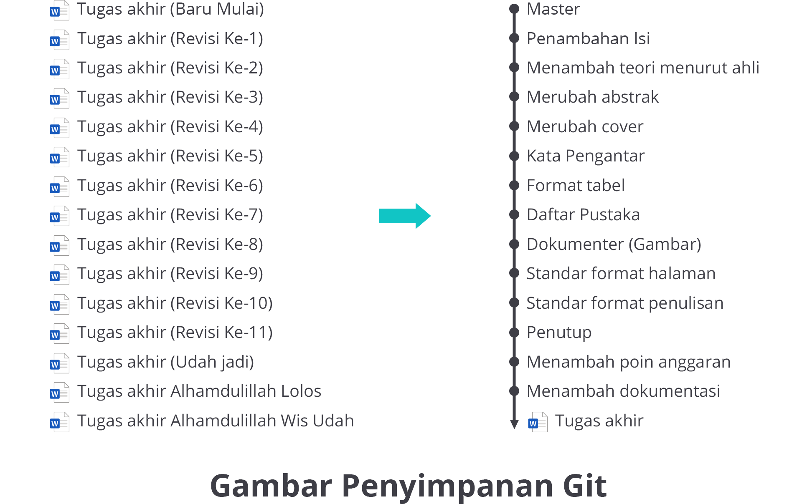
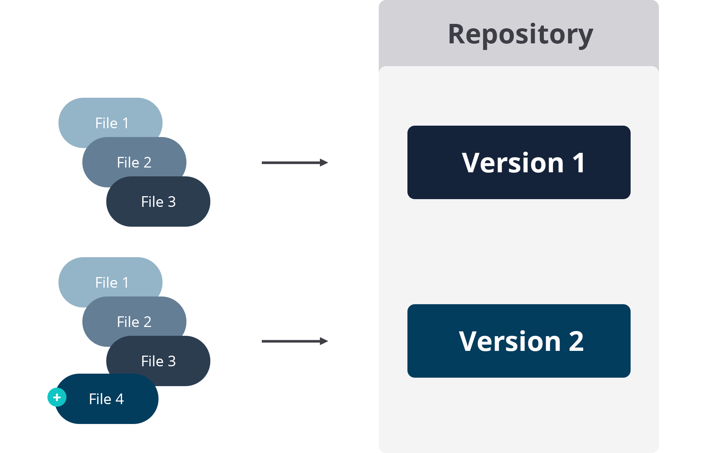
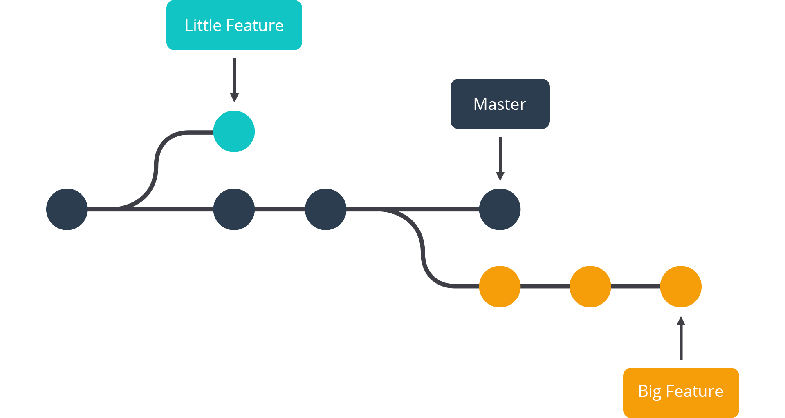
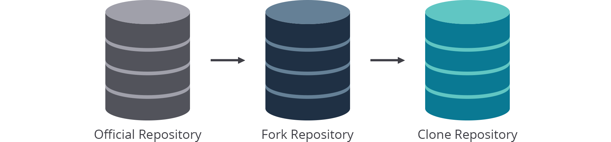
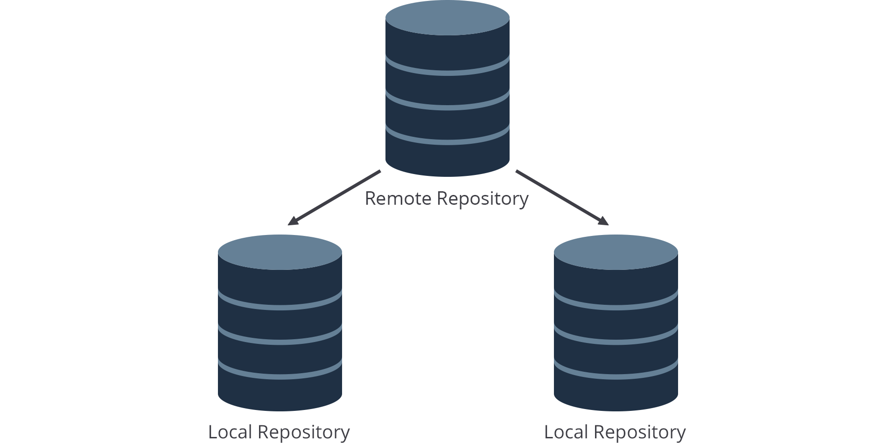
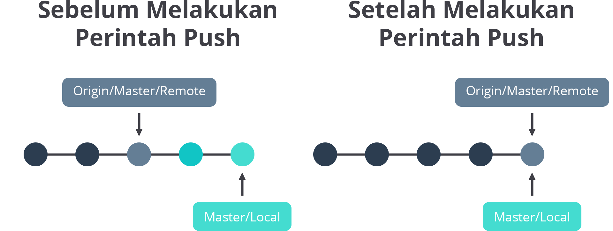

## Mengenal Git secara Lebih Dalam

Git yang dapat memberikan kemudahan pada tim untuk melakukan komunikasi saat proses pengerjaan proyek, melihat riwayat perubahan pengerjaan, serta menuntaskan pekerjaan tanpa harus saling menunggu satu sama lain.

Pernahkah Anda mengerjakan tugas penulisan misalnya tugas akhir dan membuat versi revisi ke dalam folder, kemudian memberikan nama revisi 1, revisi 2, dan seterusnya, lalu menyimpannya di komputer lokal atau penyimpanan cloud? Jika iya, pastinya itu akan memakan ruang yang banyak untuk sekadar menyimpan hasil revisi tugas akhir.
 
 
 
Oleh karena itu, Anda dapat menggunakan Git sebagai solusi untuk menyimpan semua revisi Anda ke dalam penyimpanan yang lebih aman. **Anda bisa melihat semua revisi yang telah Anda lakukan,** bahkan mengembalikan setiap file yang kemungkinan terhapus. Intinya, riwayat setiap perubahan file akan dapat Anda lihat. Keren, kan? Kemudahan tersebut dapat ditemukan pada teknologi Git. Nah, sekarang muncul pertanyaan, apa sebenarnya Git itu?
 
 Pengembangan Git dimulai pada 3 April 2005, Linus Torvalds mengumumkan proyeknya pada 6 April 2005, kemudian Git mampu melakukan self-hosting pada keesokan harinya. Penggabungan (merge) beberapa cabang pertama kali dilakukan pada 18 April 2005. Linus Torvalds mencapai sasaran performanya pada 29 April 2005, Git sudah tercatat mengirimkan patch ke root kernel Linux dengan kecepatan 6,7 patch per detik. Pada 16 Juni 2005, Git mengeluarkan rilis kernel Linux versi 2.6.12. Linus Torvalds menyerahkan pemeliharaan Git pada 26 Juli 2005 kepada Junio Hamano, seorang kontributor besar dalam proyek. Hamano bertanggung jawab atas rilis 1.0 pada 21 Desember 2005 dan terus menjadi pemelihara utama proyek Git tersebut.
 
Karakteristik kinerja Git sangat kuat jika dibandingkan dengan banyak alternatif version control system lainnya. Semua proses untuk version control, baik perubahan baru, percabangan, penggabungan, maupun perbandingan versi baru dengan sebelumnya telah dioptimalkan. 

Ketahuilah! Algoritma yang diimplementasikan di dalam Git memanfaatkan pengetahuan mendalam tentang atribut umum dari tree source code dan bagaimana mereka biasanya dimodifikasi dari waktu ke waktu. 

Dengan memanfaatkan Git, kita bisa berkolaborasi dalam tim. Jadi, kita tidak perlu lagi mengerjakan pengembangan sistem ataupun hal lainnya yang berbasis text dengan cara antrean alias menunggu anggota tim pertama selesai mengerjakan kemudian mengirimkan hasil pekerjaan kepada anggota berikutnya untuk melanjutkannya. Tentunya itu akan banyak memakan waktu dan juga tidak efektif. 

### Git Repository
Git Repository (Repositori Git) merupakan wadah penyimpanan kumpulan file dari berbagai versi proyek yang berbeda. Kumpulan file ini diimpor melalui repository ke server lokal pengguna untuk pembaruan dan modifikasi lebih lanjut dalam konten file.

VCS (Version Control System) atau Sistem Kontrol Versi digunakan untuk membuat versi dan menyimpannya di tempat tertentu yang disebut sebagai repository. Proses menyalin konten dari Repositori Git menggunakan bantuan berbagai alat Git disebut sebagai kloning (clone). Setelah proses kloning selesai, pengguna mendapatkan repository lengkap di mesin lokalnya. Pada posisi ini, Git akan mengasumsikan bahwa berbagai hal yang akan dikerjakan oleh pengguna terjadi pada repository lokal. Pengguna juga dapat membuat repository baru atau menghapus repository yang ada.

 
 
Sebuah Git repository memungkinkan Anda melakukan berbagai operasi di atasnya untuk membuat versi yang berbeda dari proyek. Operasi ini termasuk penambahan file, membuat repository baru, melakukan tindakan, atau menghapus repository. Modifikasi ini akan menghasilkan pembuatan versi proyek yang berbeda.

### Git Branch

Git Branch merupakan fitur yang dapat digunakan untuk membuat sebuah percabangan untuk versi baru dari proyek Anda. Penggunaan Git Branch ini sangat berguna pada saat Anda melakukan eksperimen dengan proyek Anda. Dengan begitu, Anda tidak akan mengubah apa pun di dalam proyek utama.

 
 
Pada Git branch terdapat cabang utama (master) sebagai induk dari pekerjaan. Selain itu, terdapat juga percabangan baru yang dapat Anda visualisasikan sebagai penambahan fitur, ada fitur kecil dan fitur besar.
 
 ### Git Fork
 Fork merupakan salinan dari sebuah repository orang lain yang tersimpan di dalam sebuah repository Git. Forking repository memungkinkan Anda untuk bereksperimen dengan bebas dan membuat perubahan tanpa memengaruhi repository utamanya.
 
  
  
Alur kerja fork dimulai dengan menemukan repository publik asli yang tersimpan dalam server. Namun ketika pengembang ingin memulai mengerjakan proyek, mereka tidak langsung mengkloning repository resmi. Sebagai gantinya, mereka mengambil repository resmi untuk membuat salinannya di server. Salinan baru ini bersifat sebagai repository publik pribadi mereka. Tidak ada pengembang lain yang diizinkan untuk mengirim perubahan pada repository tersebut. Namun, mereka dapat mendapatkan perubahan dari repository tersebut. Selain bersifat publik, kita juga dapat menyimpan salinan repository menjadi private. Sehingga pengembang lain tidak akan bisa melihat perubahan yang telah kita lakukan.

### Git Clone
Git Clone hampir sama dengan Git Fork, keduanya sama-sama melakukan salinan pada repository. Yang berbeda adalah saat melakukan git fork, repository akan disimpan berada di dalam server. Sedangkan untuk git clone, hasil salinannya disimpan dalam penyimpanan lokal. Perintah Git Clone adalah cara yang paling umum bagi pengguna untuk mendapatkan salinan tulisan. Melakukan Clone hanya dilakukan satu kali, yaitu saat akan mengerjakan satu proyek yang telah tersimpan di dalam Git repository. Kemudian pengembang menyalin proyek yang tersimpan di dalam repository untuk diletakkan di penyimpanan lokal. Setelah pengembang mendapatkan salinan pekerjaan, semua operasi dan kolaborasi kontrol versi dikelola melalui repository lokal.

 
 
Penggunaan clone paling umum digunakan untuk mengambil satu repository yang ada dan membuat clone dari repository tersebut ke direktori baru di lokasi lain. Repository asli dapat ditemukan di sistem file lokal atau pada protokol yang didukung untuk dapat diakses melalui jarak jauh.

Untuk memudahkan, cloning secara otomatis membuat koneksi jarak jauh (remote) yang disebut dengan “origin” yang mengacu dari repositori lokal ke repository asli (di server). Ini membuatnya sangat mudah untuk berinteraksi dengan repository pusat.

### Git Push

Perintah Git push merupakan tindakan lanjutan dari perintah Git commit. Git push mengunggah semua commit cabang (branch commit) pada repository lokal ke repository server. Secara default, Git push hanya memperbarui cabang yang sesuai pada remote. Sehingga jika Anda sedang berada di branch master atau melakukan check out ke master dengan perintah Git push, hanya branch master-lah yang akan diperbarui.

### Penggunaan Git push

Setelah membuat dan melakukan perubahan secara lokal, Anda dapat membagikannya dengan repository di server menggunakan Git push. Mendorong perubahan ke server akan membuat commit Anda dapat diakses oleh orang lain yang mungkin berkolaborasi dengan Anda. Ini juga akan memperbarui permintaan dengan cabang yang sedang Anda kerjakan.

Ketika Anda menggunakan antarmuka GitHub, setiap commit yang dilakukan akan tersimpan secara langsung di repository. Sehingga Anda tidak perlu menjalankan perintah git push dan git pull. 

Namun, ketika Anda menggunakan penyimpanan lokal, penting untuk menjalankan perintah Git pull sebelum meng-upload (git push) perubahan baru ke server. Dengan melakukan git pull, repository lokal akan diperbarui sesuai dengan repository remote saat ini. Sehingga ketika ada kontributor lain yang melakukan perubahan pada repository server, repository lokal ikut diperbarui. Melakukan git pull (menarik) sebelum Anda melakukan git push (mendorong), dapat mengurangi jumlah konflik pada proses penggabungan yang dibuat, serta memungkinkan Anda untuk menyelesaikannya permasalahan secara lokal sebelum mendorong perubahan ke  server.
