## Mengenal GitHub secara Lebih Dalam

GitHub adalah perusahaan yang menawarkan layanan hosting repository Git berbasis cloud. Pada dasarnya, GitHub membuat para pengguna individu dan tim menjadi lebih mudah untuk menggunakan Git dalam mengendalikan setiap versi pekerjaan saat melakukan kolaborasi di dalam ataupun antar tim. 

GitHub menawarkan paket repository private dan gratis yang dapat digunakan untuk proyek membuat perangkat lunak open source. GitHub mempunyai sebuah maskot yang bernama *Octocat*, seekor kucing dengan lima tentakel dan wajah seperti manusia. Berikut rekam jejak terbaik GitHub dalam beberapa waktu terakhir:

 * Pada tahun 2016, GitHub menduduki posisi 14 di Forbes Cloud 100 list. 
* Kemudian pada tanggal 4 Juni 2018, Microsoft mengakuisisi GitHub sebesar 7,5 miliar dolar. 
* Selanjutnya pada tanggal 19 Juni 2018, GitHub memperluas GitHub Education dengan menawarkan bundel pendidikan gratis ke semua sekolah.

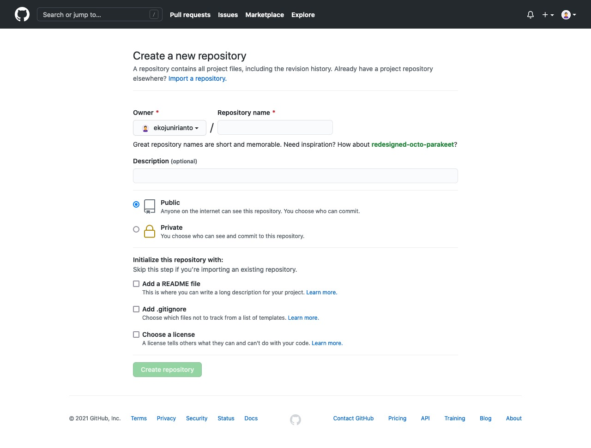

### Explore Repository

Pada halaman GitHub terdapat fitur untuk melakukan pencarian repository milik orang lain. Sehingga  pada saat Anda ingin mencari bahan sebagai referensi untuk memulai proyek dapat menggunakan fitur explore ini.

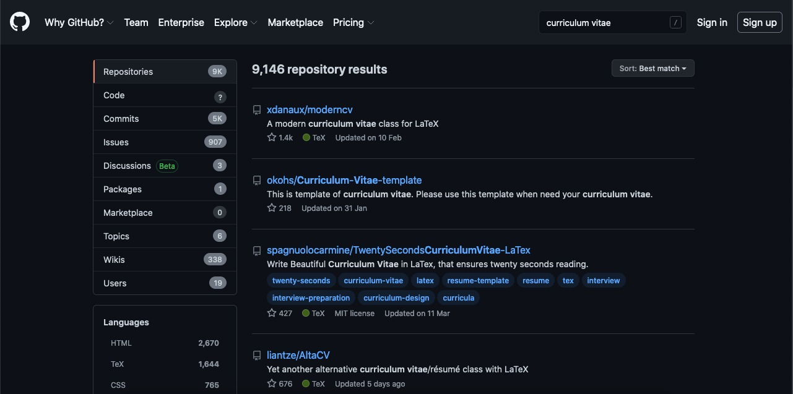

### Detail File Repository

Jika kita memilih salah satu repository dari hasil pencarian, maka akan terlihat detail berupa daftar beberapa file yang ada pada repository tersebut. 

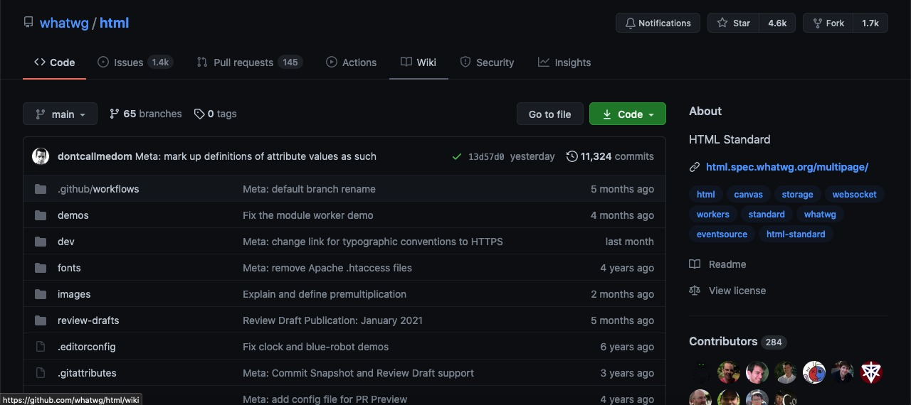

Pada detail dari repository tersebut terdapat menu “code” yang memiliki beberapa pilihan menu di dalamnya, seperti alamat link untuk melakukan clone, mengambil repository menggunakan GitHub Desktop, dan download repository dalam bentuk file zip.

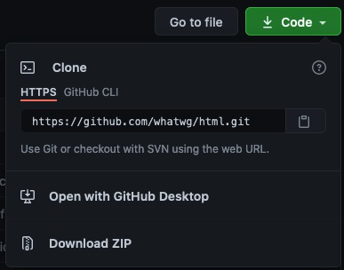

Selanjutnya, terdapat beberapa menu tab yang masing-masing menu memiliki fungsi tersendiri.

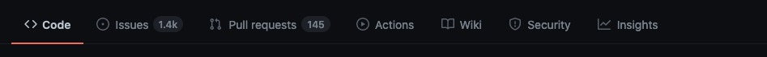

Menu tab “issues” merupakan kumpulan dari semua pertanyaan seputar permasalahan yang terjadi saat user mencoba untuk mengambil dan meng-explore file yang ada pada repository tersebut sehingga mereka dapat mengajukan pertanyaan di dalam “issues” tersebut.

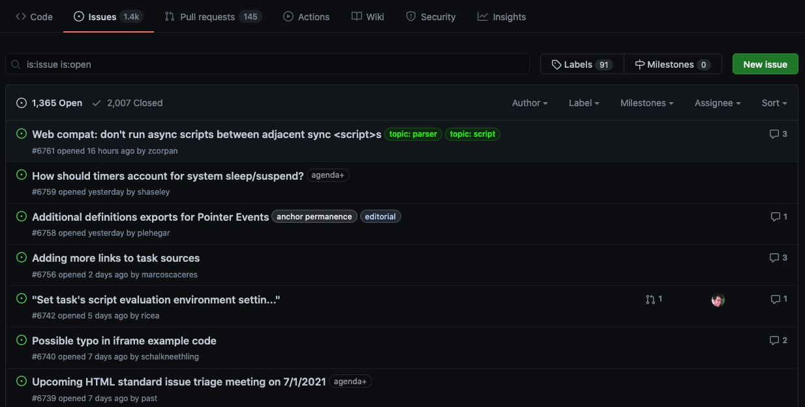

Setiap perubahan pada file repository ataupun penambahan file, maka riwayat perubahan tersebut akan terlihat pada “pull request”. Selain itu, user yang melakukan perubahan pada file tersebut juga akan terlihat pada menu tab ini.

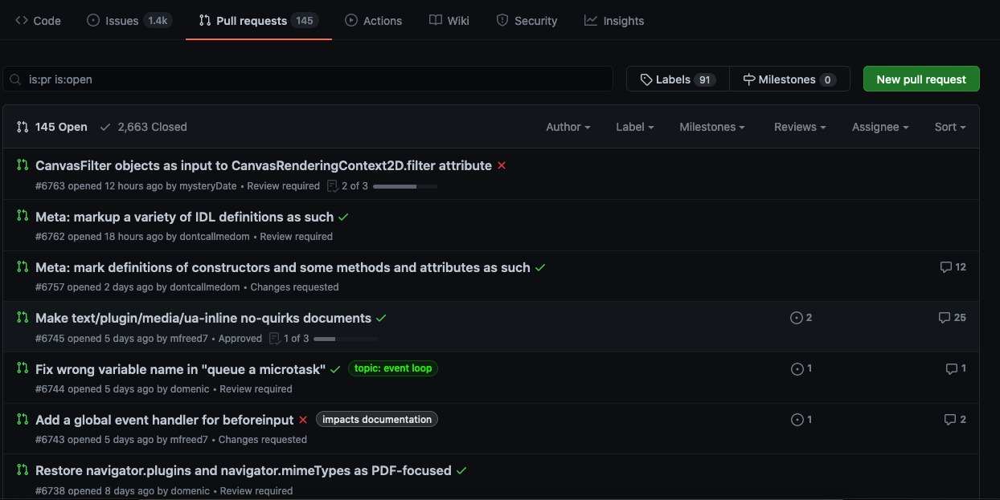

### Dashboard GitHub

Berikut tampilan dari halaman dashboard setelah login dengan akun GitHub. Pada dashboard ini kita dapat melihat repository apa saja yang sudah Anda buat serta melihat repository lainnya yang Anda ikuti. 

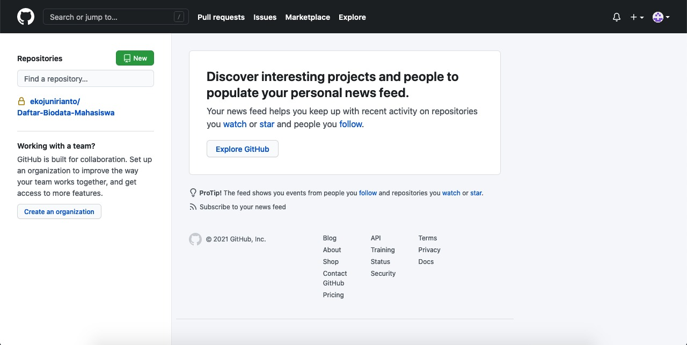

### Fitur Pendukung

GitHub memberikan fitur lainnya yang dapat digunakan. Untuk mengaksesnya, Anda dapat mengarahkan kursor pada logo tambah/plus (+) di kanan atas.

Berikut deskripsi dari item-item dalam fitur tersebut:

### New Repository
Dengan GitHub, Anda dapat membuat repository baru dengan mudah.

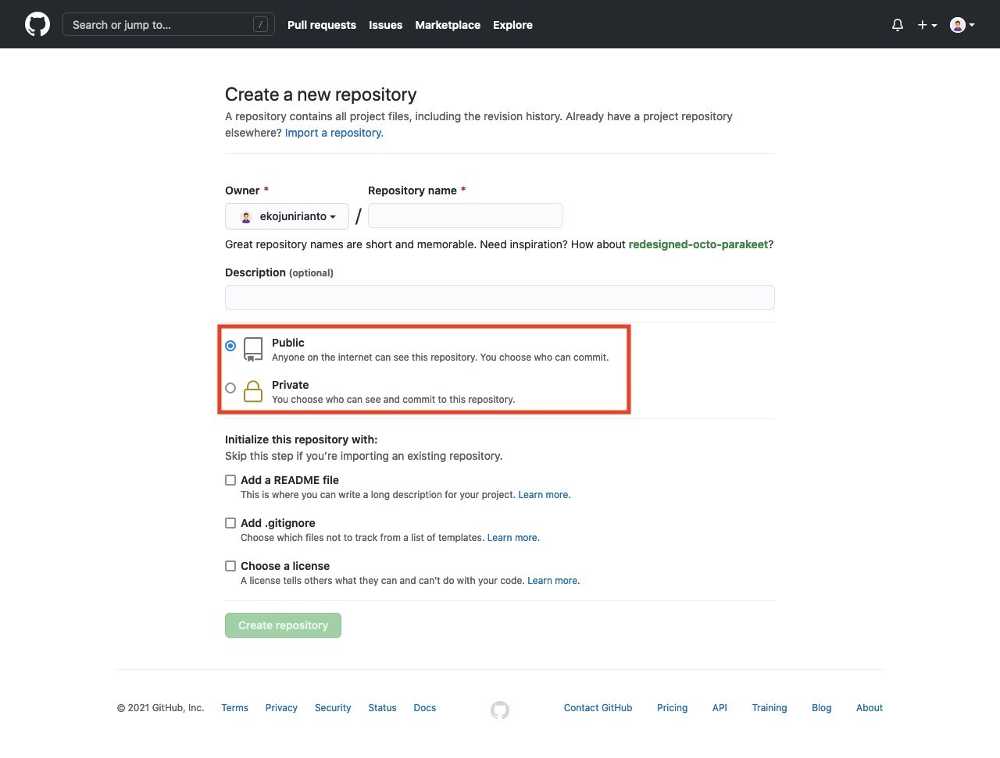

GitHub menyediakan dua jenis repository, yakni:
        Public (repository dapat dilihat oleh semua pengguna Internet, misalnya pada explore repository).
        Private (bersifat pribadi dan hanya user yang diberi akses yang dapat membukanya).

### Import Repository
Anda dapat mengambil/menyalin file proyek dari vendor lain seperti Subversion atau Mercurial ke dalam repository baru pada GitHub. Proses impor dilakukan dengan menggunakan link URL.

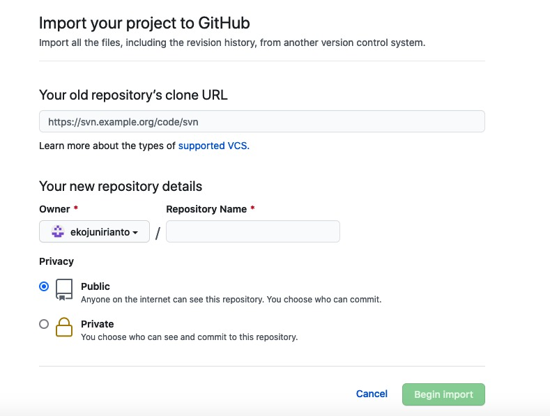

### Gist
Gist (Intisari) merupakan fitur yang ditambahkan ke GitHub untuk memungkinkan berbagi potongan kode, catatan, melakukan daftar, dan lainnya. Seperti halnya repositori, Anda dapat menyetel dan menyimpan Intisari Anda sebagai rahasia atau publik.
   
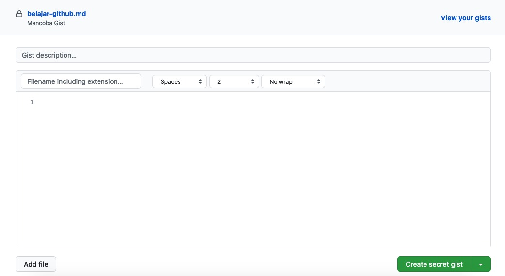

Secret Gists disembunyikan dari mesin pencari, tetapi dapat dilihat oleh siapa saja jika Anda berbagi url.

### GitHub Organization
GitHub Organization memungkinkan Anda untuk dapat berkolaborasi bersama pada suatu organisasi misalnya untuk bisnis dengan sejumlah kelebihan misalnya banyak proyek sekaligus. Pemilik dan administrator dapat mengelola hak akses anggota ke suatu data atau proyek dengan fitur keamanan dan administratif yang canggih.

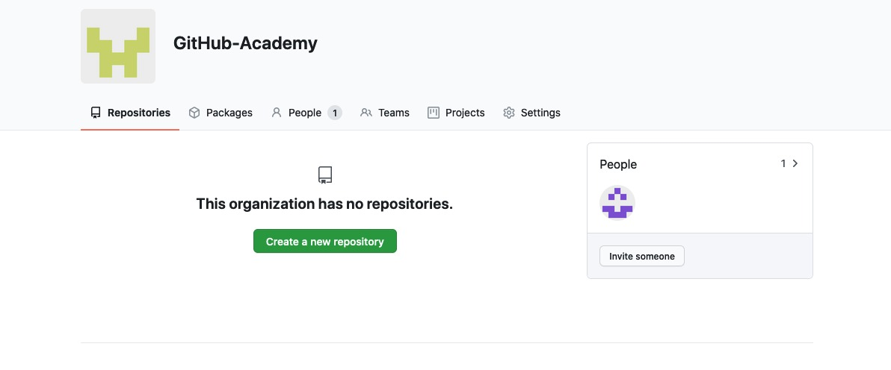

Fitur GitHub organization meliputi:
        Seluruh yang ada di opsi gratis (GitHub Free) dengan kolaborator pada repository publik tak terbatas dengan fitur lengkap dan repository pribadi tetapi dengan fitur terbatas. 
        Opsi untuk meningkatkan ke GitHub Team atau GitHub Enterprise Cloud untuk fitur tambahan, termasuk autentikasi dan manajemen pengguna yang canggih, serta opsi dukungan yang ditingkatkan. Untuk informasi lebih lanjut, silakan lihat Produk GitHub.
        Keanggotaan tanpa batas dengan berbagai peran yang memberikan berbagai tingkat akses ke organisasi dan datanya.
        Kemampuan untuk memberi berbagai izin akses ke repository organisasi Anda.

GitHub Project
    GitHub Project dapat membantu Anda untuk mengatur dan memprioritaskan pekerjaan. Anda dapat membuat papan proyek (project board) untuk mengerjakan fitur tertentu, peta alur yang komprehensif (comprehensive roadmaps), atau bahkan merilis daftar periksa (release checklists). Dengan papan proyek, Anda memiliki fleksibilitas untuk membuat alur kerja khusus yang sesuai dengan kebutuhan Anda.
    202107021454381182b75854268d9d48f07a31bd8580d9.jpeg

Dalam GitHub project, Anda dapat menyertakan repository yang akan dijadwal dan alur pengerjaan, serta dapat menambahkan tim yang terlibat dalam proyek tersebut.

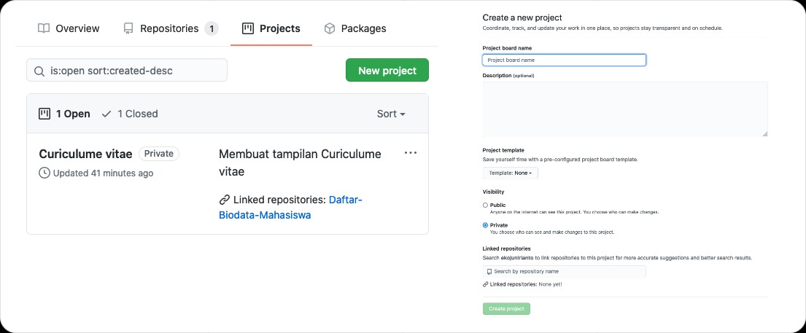
