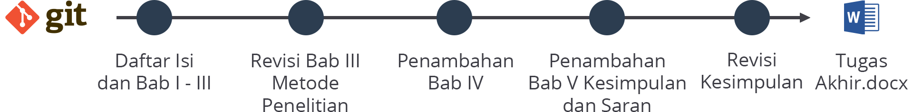

## Pengantar Dasar Git

GitHub ini merupakan sistem kontrol versi yang terdistribusi dengan fungsionalitas manajemen kode sama seperti Git sekaligus menyediakan penyimpanan cloud serta 

Dengan Git, para pengguna GitHub dapat melacak perubahan pada file yang berada dalam direktori kerja atau repository sehingga memudahkan mereka untuk mengetahui perubahan pada file ataupun source code program.

Selain itu, dengan bekerja menggunakan Git, Anda dapat bekerja secara tim dan berkolaborasi dengan beberapa orang untuk mengerjakan proyek yang sama. Dalam Git, kita dapat membuat cabang (branch) yang berfungsi untuk memisahkan alur kerja (workflow)

Secara garis besar, cara kerja dari sistem Git sendiri yaitu merekam setiap perubahan pada file atau penambahan file dalam direktori kerja atau repository dengan cara menjalankan perintah Commit pada Git. 

Nah, apa itu Commit? Commit itu seperti snapshot (cuplikan) dari repository Anda pada waktu tertentu dan merupakan salah satu perintah dasar Git untuk menyimpan perubahan setiap file dalam repository di mana perubahan yang telah di-commit akan tersimpan riwayat perubahannya. Kita bisa mengambil salah satu contoh kasus dalam penggunaan Git sebagai kontrol versi yaitu sebuah skripsi mahasiswa.

Lain halnya jika mengerjakan skripsi menggunakan Git, mahasiswa dapat menyimpan history perubahan skripsi hanya dengan satu file karena sistem Git dapat menyimpan perubahan pada file skripsi itu sendiri. Sehingga lebih efisien dalam hal kuantitas file serta tidak memakan kapasitas penyimpanan yang besar.

Dalam gambar di atas, ilustrasi penggunaan Git pada proyek skripsi di mana setiap perubahan pada file skripsi yang sudah berhasil di-commit tercatat pada riwayat Git yang mana disimbolkan dengan lingkaran. 

Lalu, bagaimana jika ingin mengembalikan file skripsi ke versi yang lama? Tenang saja, Git memiliki perintah untuk mengembalikan versi file skripsi sesuai dengan commit yang sudah tercatat di riwayat. Pada setiap riwayat commit terdapat kode atau alamat yang jika sewaktu-waktu diperlukan untuk mengembalikan versi file ke versi sebelumnya, kita cukup menjalankan perintah-perintah Git. 

Sebelum menggunakan Git, kita perlu tahu beberapa perintah dasar tentang Git, seperti apa itu Commit, Checkout, Revert, dan Reset. Perintah-perintah tersebut akan kita pelajari lebih dalam di materi selanjutnya.
