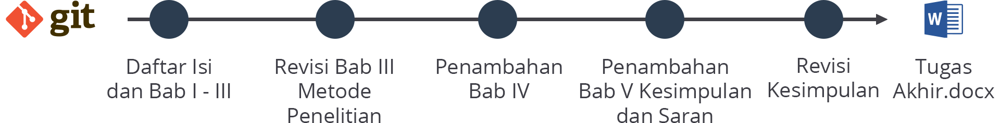
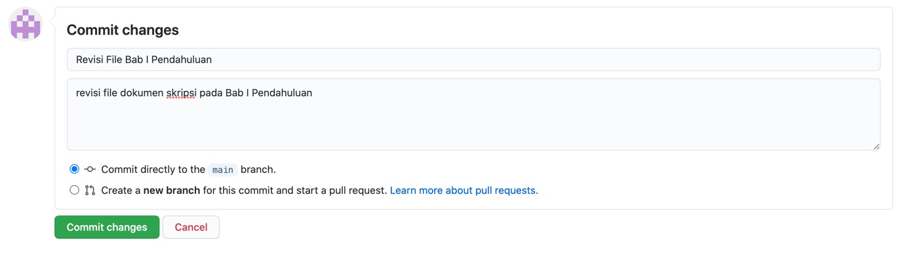
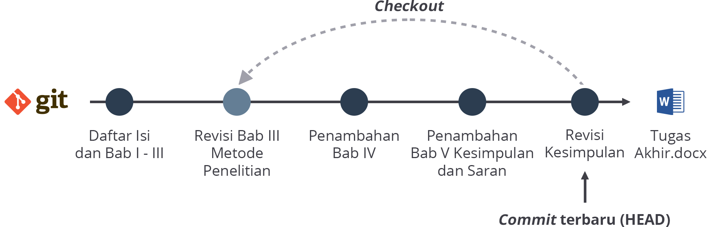
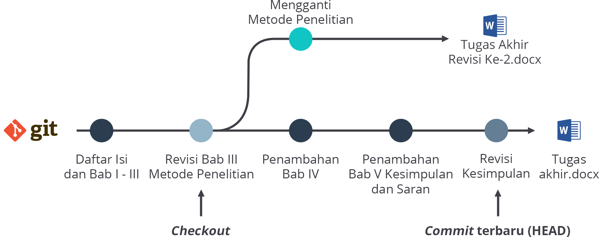
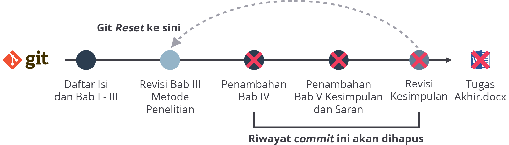
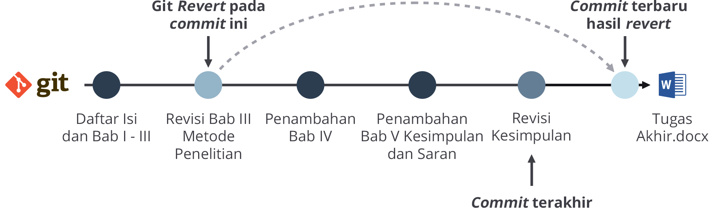

## Mengenal Perintah Dasar Git secara Lebih Dalam

Pada Materi sebelunya kita sudah mengetahui garis besar dari Git dan pentingnya Git. Kali ini kita akan mengupas lebih dalam mengeai perintah-peritah dasar Git. Ketahuilah, ada bebarapa perintah dasar yang sering digunakna para pengguna Git dalam mengontrol versi proyek mereka di direktori kerja. Apa saja itu? Mari simak penjelasan setiap perintah berikut:

### Git *Commit*

seperti yang sudah dibahas sebelumnya. Git Commit merupakan perintah untuk menyimpan hasil perubahan setiap file yang ada di dalam direktori kerja, baik itu file yang baru saja ditabahkan maupun file yang terjadi perubahan.

*Commit* berisi catatan-catatan tentang apa saja yang berubah di dalam sebuah repository. Titik *commit* inilah yang nantinya akan menjadi acuan apabila kita ingin mengembalikan *repository* ke keadaan tertentu. Ingat ketika melakukan *commit*, jangan lupa untuk menyisipkan *message* atau pesan perihal apa saja perubahan yang terjadi di *repository* agar kita lebih mudah mengenali setiap commit yang tercatat di riwayat.

pada platform GitHub, ketika kita membuat file baru, mengunggah file baru, atau melakukan perubahan file yang ada di repository, terdapat kolom message atau pesan dan kolom opsional deskripsi *commit* untuk lebih menjelaska perubahan yang dilakukan. Kedua kolom tersebut terletak pada bagian bahwa sat kita ingin menyimpan perubahan.

Penulisan commit message harus bisa menjelaskan tentang perubahan apa saja yang dilakukan. Hal ini akan memudahkan kerja tim karena setiap anggota menjadi mengerti mengapa terjadi perubahan pada berkas tersebut.

### Git *Checkout*

*Git Checkout* merupakan perintah layaknya mesin waktu di mana perintah ini memungkinkan para pengguna Git untuk melakukan pengembalian kondisi berkas seperti waktu yang dituju atau *commit* yang dituju. Akan tetapi, ini bersifat sementara (temporer). Kita bisa sebut bahwa perintah ini sebagai perintah untuk mengecek kondisi setiap file di setiap *commit.*

Selain itu, perintah ini juga bisa digunakan untuk berpindah dari satu cabang kerja ke cabang kerja yang lain atau dapat kita gunakan untuk membuat perubahan baru berdasarkan *commit* di masa lalu.

Git *Checkout* sangat berguna ketika kita ingin melakukan pengembalian kondisi berkas pada *commit* tertentu, lalu mengubahnya, dan membuat *branch* baru agar tidak mengganggu riwayat perubahan sesudahnya. Cara ini bisa kita ibaratkan seperti menulis cerita baru dengan plot yang berbeda.

### Git Reset

Git Reset, seperti namanya, perintah ini berfungsi untuk mengatur ulang. Maksudnya, perintah ini merupakan perintah untuk mengembalikan suatu kondisi berkas ke commit yang dituju dan menghapus riwayat sesudahnya.

Perintah Git *Reset* sering disebut sebagai perintah yang berbahaya karena dapat menghancurkan catatan sejarah perubahan. Hati-hati dalam penggunaan Git *Reset* karena sekali melakukannya, kita tidak akan bisa kembali ke masa depan sehingga perlu pertimbangan yang matang saat menggunakannya.

### Git Revert

Git *Revert* merupakan perintah yang mirip dengan reset, tetapi fungsinya lebih daripada Git *Reset*.  Perintah ini akan mengembalikan kondisi suatu berkas ke waktu/*commit* yang dituju tanpa menghapus catatan riwayat *commit.*

Seperti gambar ilustrasi di atas, perintah Git *Revert* bekerja dengan cara membuat *commit* terbaru dengan *commit* yang dituju sehingga riwayat *commit* **di antaranya** tidak terhapus. Git *Revert* akan mengambil kondisi berkas yang ada di masa lalu, kemudian menggabungkannya dengan *commit* terakhir.
